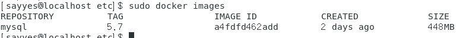
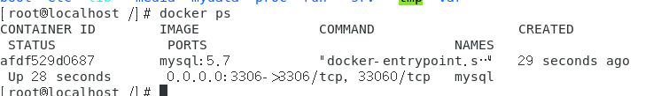
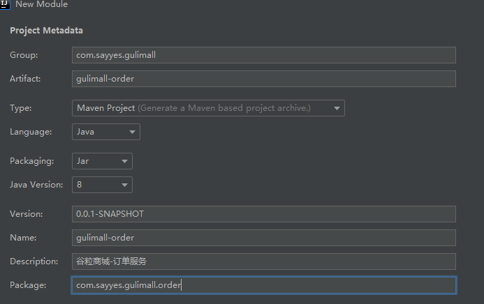
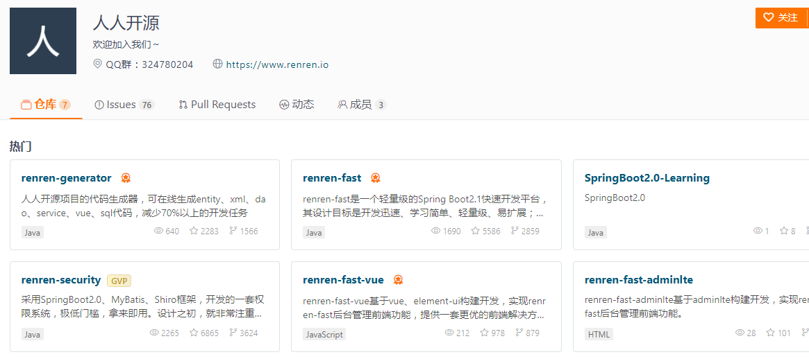
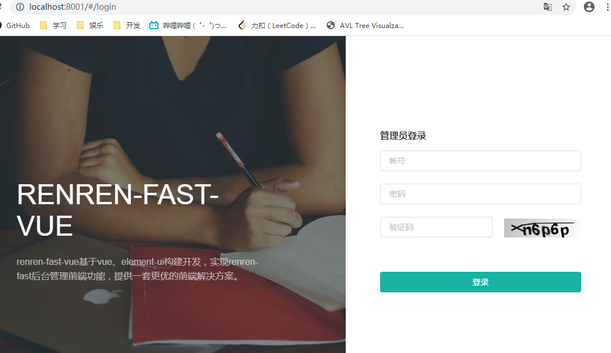
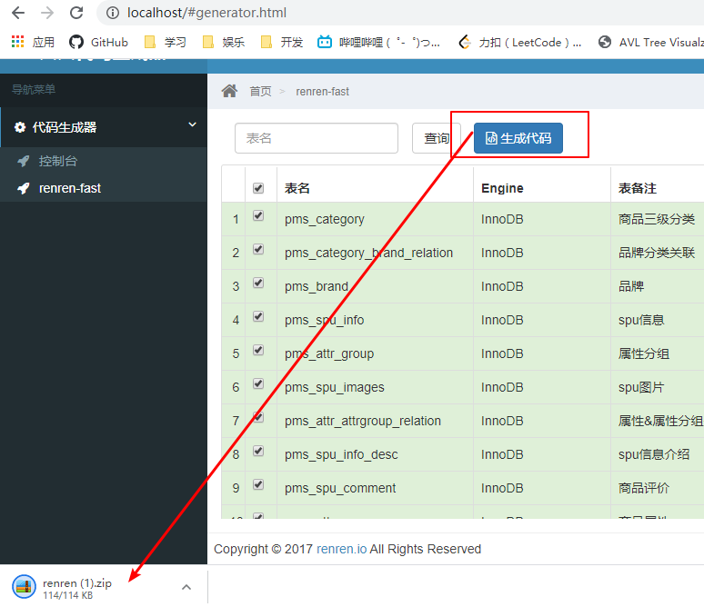
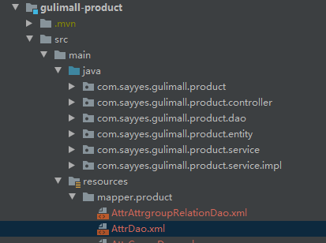
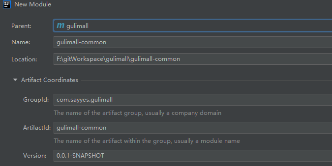

# 谷粒商城项目案例

## 一、环境准备

### 1、安装Linux虚拟机

> CentOS或ubuntu
>
> 可以使用echo $LANG看服务器语言，uname查看系统命

### 2、安装docker

> 1、容器技术，可以快速搭建mysql、redis等应用。
>
> 2、仓库地址：https://hub.docker.com/
>
> 3、官方文档：https://docs.docker.com/

1）根据https://docs.docker.com/engine/install/centos/文档在centos虚拟机上面执行安装

2）安装是否成功可以docker -v查看版本

3）设置随虚拟机启动，不需要每次sudo systemctl start docker

​		设置为：sudo systemctl enable docker

4）配置镜像加速功能，推荐阿里云

https://cr.console.aliyun.com/cn-hangzhou/instances/mirrors

```shell
sudo mkdir -p /etc/docker
sudo tee /etc/docker/daemon.json <<-'EOF'
{
  "registry-mirrors": ["https://4qj7hnfl.mirror.aliyuncs.com"]
}
EOF
sudo systemctl daemon-reload
sudo systemctl restart docker
```

### 3、安装mysql

#### 1）在docker仓库中搜索下载

#### 2）**docker pull mysql:版本号，如果不跟:版本号是下载最新的**

#### 3）**使用sudo docker images查看镜像是否下载成功**



#### 4）创建实例并启动

```shell
docker run -p 3306:3306 --name mysql \
-v /mydata/mysql/log:/var/log/mysql \
-v /mydata/mysql/data:/var/lib/mysql \
-v /mydata/mysql/conf:/etc/mysql \
-e MYSQL_ROOT_PASSWORD=root \
-d mysql:5.7
#参数说明：
	-p 3306：3306，将容器的3306端口映射到主机的3306端口
	--name mysql 命名
	-v 将配置文件、日志文件、数据文件挂载到主机，相当于linux外部快捷访问方式。
	-e 初始化root用户的密码
	-d 使用哪个镜像版本
```

#### 5）查看进程docker ps



#### 6）查看连接是否成功

mysql -h 主机地址 -u 用户名 -p 用户密码

#### 7）进入容器mysql内部

docker exec -it mysql /bin/bash

#### 8）配置mysql文件

```shell
vi /mydate/mysql/confi/my.cnf
添加内容如下：

[client]
default-character-set=utf8

[mysql]
default-character-set=utf8

[mysqld]
init_connect='SET collation_connection = utf8_unicode_ci'
init_connect='SET NAMES utf8'
character-set-server=utf8
collation-server=utf8_unicode_ci
skip-character-set-client-handshake
skip-name-resolve
```

#### 9）docker重启mysql 

docker restart mysql

#### 10）设置Mysql自动启动

docker update mysql --restart=always

#### 11）mysql可视化工具

SQLyog工具

### 4、安装redis

#### 1）docker pull redis下载

#### 2）创建实例并启动

```shell
#先创建文件，不然会当作目录来处理
mkdir -p /mydata/redis/conf
touch /mydata/redis/conf/redis.conf

docker run -p 6379:6379 --name redis \
-v /mydata/redis/conf/redis.conf:/etc/redis/redis.conf \
-d redis redis-server /etc/redis/redis.conf

#补充说明：
-d redis-server /etc/redis/redis.conf以这个配置文件加载启动
```

#### 3）查看进程docker ps

#### 4）测试是否可以正常使用

```shell
[root@localhost conf]# docker exec -it redis redis-cli
127.0.0.1:6379> set a b
OK
127.0.0.1:6379> get a
"b"
```

#### 5）docker重启redis

docker restart redis

#### 6）设置redis自动启动

docker update redis --restart=always

#### 7）redis.conf文件持久化配置（重启不会丢失缓存）

appendonly yes

#### 8）redisk可视化工具（可选）

redisdesktopmanager工具

### 5、开发环境

- jdk1.8

- maven（本地文件配置、idea配置）

- idea（java开发）
  - 插件安装Lombok（简化代码开发）
  - 插件安装MybatisX（快速从mapper定位xml文件）

- VSCode（前端开发）
  - 插件Auto Close Tag
  - 插件Auto Rename Tag
  - Chinese Language Pack for VS
  - Eslint
  - html css support
  - html suippets
  - javascript(es6)
  - live server
  - open in browser
  - vetur
- git 版本管理

## 二、项目开发

### 1、idea创建工程各个模块（Spring Initializr向导）

单个创建向导：

商品服务、仓储服务、订单服务、优惠券服务、用户服务

共同：

​		spring的共同部分web、openfeign

​		每个服务，包名类似，除了根据服务不同区分



### 2、创建mysql数据库

数据库和表：见doc/sql文件夹下。

### 3、后台管理系统

#### 1）这里可以使用码云开源项目快速搭建，节省时间把关注放到高并发、高可用上面。

> 这里先使用fast、fast-vue快速搭建



#### 2）使用renren-fast（后台）

- 项目clone下来加入自己本地项目中

- 创建后台管理库gulimall_admin，并执行开源项目自带db的mysql脚本

- 修改application配置文件（数据库连接内容）

- 直接运行RenrenApplication.java测试数据库连接情况，然后浏览器访问http://localhost:8080/renren-fast/

  ```
  界面显示：{"msg":"invalid token","code":401}
  ```

#### 3）使用renren-fast-vue（前端）

- 安装node.js（最好安装10.16.3版本，防治版本不兼容问题）

> 检查安装是否成功：dos窗口下面输入node -v
>
> 安装后，需要设置镜像：
>
> ​	npm config set registry http://registry.npm.taobao.org/

- 如果没有python2，也需要安装python2，并进行环境变量配置

> npm install --global --production windows-build-tools

- vscode导入renren-fast-vue项目

> 1、在vscode里面使用npm install下载项目依赖（根据package.json），需**管理员运行该软件**
>
> 2、运行项目：npm run dev

- 浏览器打开http://localhost:8001/



#### 4）使用renren-generator（数据库逆向生成对象文件），这里先处理product的模块

- 修改application文件，修改数据库连接（逐个库去设置处理）。
- 修改generator.properties文件，调整路径和包名

```properties
mainPath=com.sayyes
#包名
package=com.sayyes.gulimall
moduleName=product
#作者
author=sayyes
#Email
email=sayyes@gmail.com
#表前缀（类名不会包含表前缀）
tablePrefix=pms_
```

- 启动该模块，然后浏览器打开：http://localhost/



- 将逆向工程包添加到指定模块，这块是gulimall-product

> 这里工程会报错，暂时不处理，创建gulimall-common管理公共模块后，然后在解决gulimall-product的报错



#### 5）创建gulimall-common模块（maven方式）

> 统一管理其他模块公共类，公共依赖（很重要）



- 每个微服务模块pom.xml添加依赖

```xml
<!--依赖公共模块-->
<dependency>
    <groupId>com.sayyes.gulimall</groupId>
    <artifactId>gulimall-common</artifactId>
    <version>0.0.1-SNAPSHOT</version>
</dependency>
```

- gulimall-common进行依赖管理、公共类处理

  > 1、处理pom.xml引入微服务模块所属依赖
  >
  > 2、部分公共类，可以从renren-fast中获取：如PageUtils.java

```xml
<!-- 案例如下 -->
<!--mybatis plus-->
<dependency>
    <groupId>com.baomidou</groupId>
    <artifactId>mybatis-plus-boot-starter</artifactId>
    <version>3.2.0</version>
</dependency>
<!--lombok-->
<dependency>
    <groupId>org.projectlombok</groupId>
    <artifactId>lombok</artifactId>
    <version>1.18.12</version>
</dependency>
<!--httpcore-->
<dependency>
    <groupId>org.apache.httpcomponents</groupId>
    <artifactId>httpcore</artifactId>
    <version>4.4.13</version>
</dependency>
<!--commons-lang-->
<dependency>
    <groupId>commons-lang</groupId>
    <artifactId>commons-lang</artifactId>
    <version>2.6</version>
</dependency>
<!--mysql-->
<dependency>
    <groupId>mysql</groupId>
    <artifactId>mysql-connector-java</artifactId>
    <version>8.0.17</version>
</dependency>
<!--servlet-->
<dependency>
    <groupId>javax.servlet</groupId>
    <artifactId>servlet-api</artifactId>
    <version>2.5</version>
    <scope>provided</scope>
</dependency>
```

- 解决gulimall-product的报错

#### 7）gulimall-product开发

- application.yml配置数据源

```yaml
# 数据源配置
spring:
  datasource:
    username: root
    password: root
    url: jdbc:mysql://192.168.70.129:3306/gulimall_pms
    driver-class-name: com.mysql.jdbc.Driver
```

- 注解扫描mapper类

```java
@MapperScan("com.sayyes.gulimall.product.dao")
@SpringBootApplication
public class GulimallProductApplication {
   // 代码段
}
```

- application.yml配置mapper的sql映射文件、主键自增

```yaml
# mapper路径配置
mybatis-plus:
  mapper-locations: classpath:/mapper/**/*.xml
  # 设置主键自增
  global-config:
    db-config:
      id-type: auto
```

- 编写测试类

```java
package com.sayyes.gulimall.product;
@SpringBootTest
class GulimallProductApplicationTests {

    @Autowired
    BrandService brandService;
    @Test
    void contextLoads() {
        BrandEntity brandEntity = new BrandEntity();
        //插入
//        brandEntity.setDescript("华为");
//        brandService.save(brandEntity);
//        System.out.println("保存成功");

        //更新
//        brandEntity.setBrandId(1L);
//        brandEntity.setDescript("中兴");
//        brandService.updateById(brandEntity);

        //删除
//        brandService.removeById(2L);

        //查询
        List<BrandEntity> list = brandService.list(new QueryWrapper<BrandEntity>().eq("brand_id", 1L));
        list.forEach((item)->{
            System.out.println(item);
        });
    }

}

```

#### 8）其他工程也是同product一样

> 在ware中有个数据表字段Longblob要改成byte[]

- 逆向工程生成代码
- 编写配置文件
- 启动主程序后访问网址http://localhost:8080/coupon/coupon/list

```java
返回结果（无记录）：
{"msg":"success","code":0,"page":{"totalCount":0,"pageSize":10,"totalPage":0,"currPage":1,"list":[]}}
```


